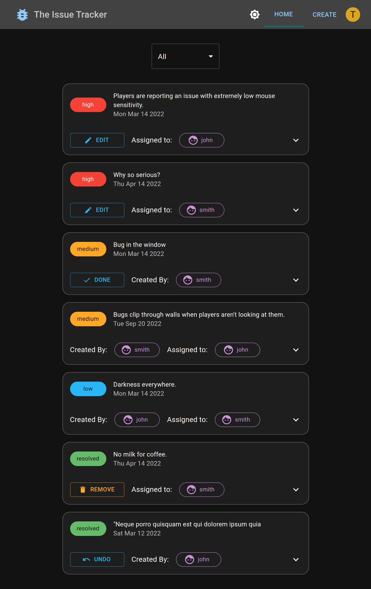
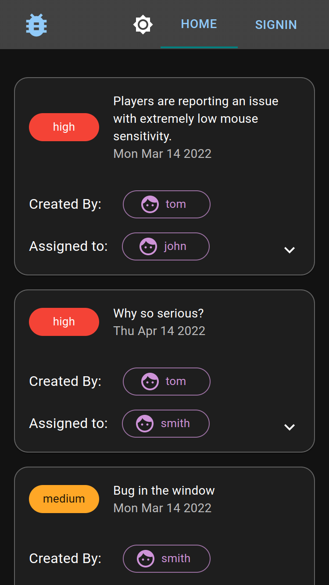
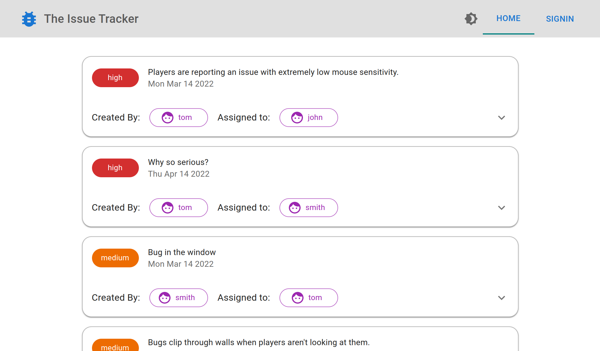
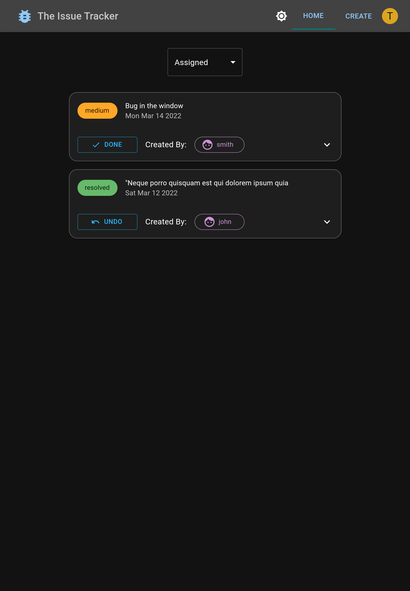
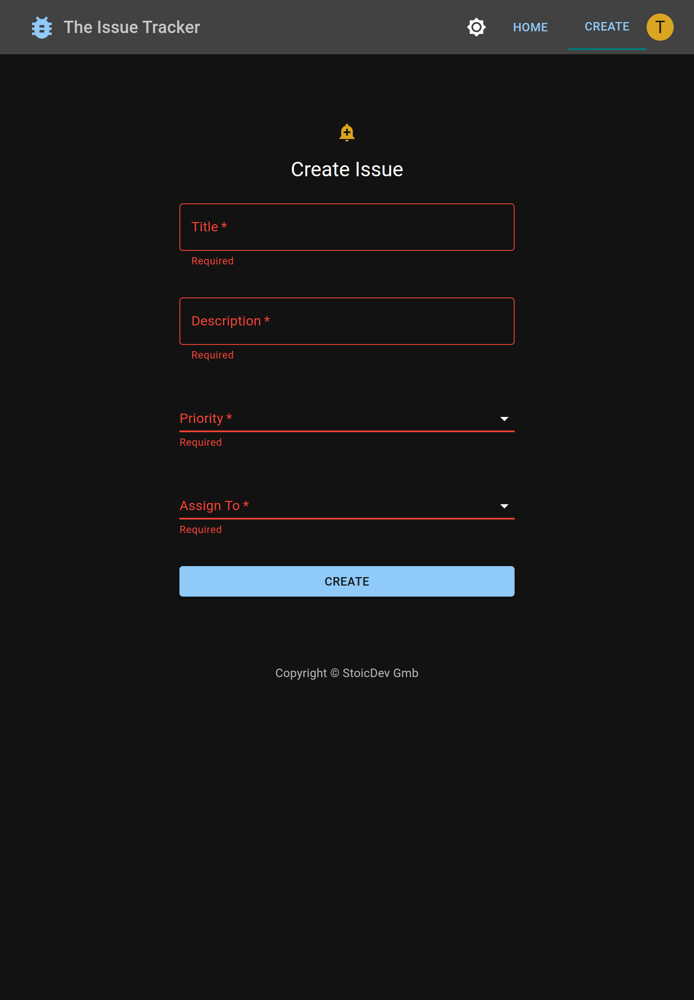
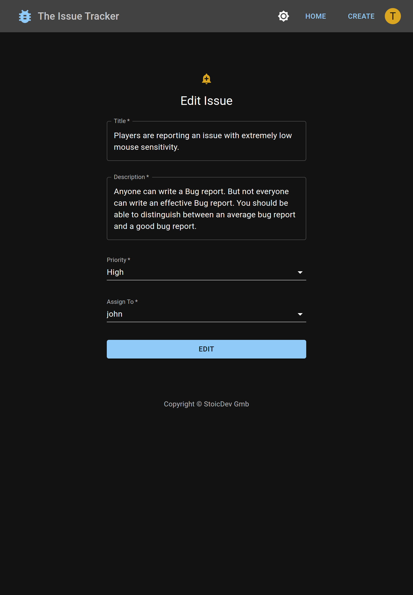
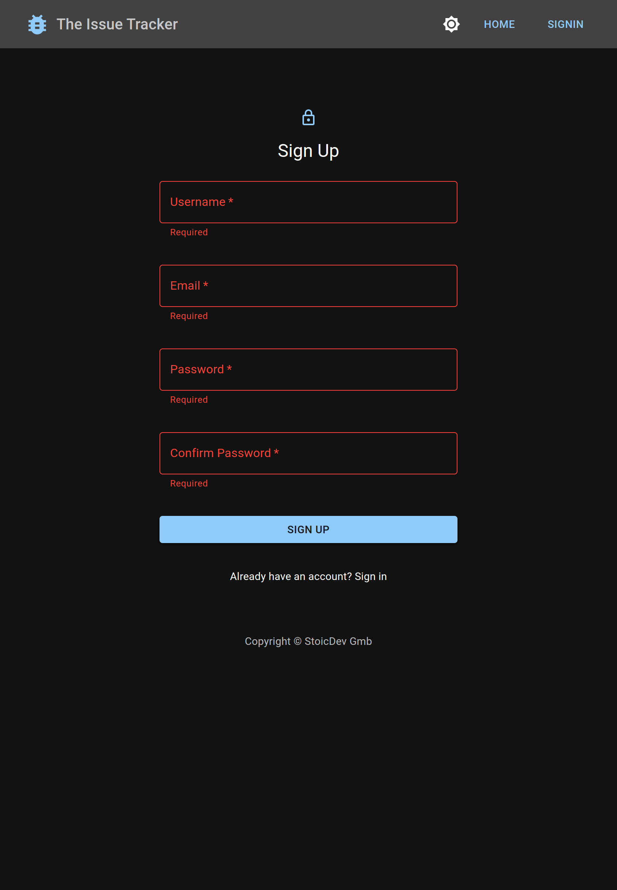

# the-issue-tracker

## Table of Contents

- [About](#about)
- [Features and Stack](#features-and-stack)
- [Screenshots](#screenshots)
- [Getting Started](#getting-started)
- [Future Work](#challenges)
- [Create React App](#bootstrapped-with-create-react-app)

## About

**The Issue Tracker** is a mobile friendly website to track issues by team members in a project.

## Features and Stack

### Features

- fully responsive with support for mobile, tablet and desktop. 
- user can signup, signin  using email and password
- user authentication  and authorization done with firebase.
- user session maintained using react useState hook. 
- backend logic and security rules implemented and tested with firebase CLI.
- data is cached using react-query to optimize network request while page hopping.
- user is remembered and is automatically signed in next time user visit the page.
- form with validation to create and edit issue.
- authorized user can perform CRUD operation in firestore database.
- only signed in user can create issues.
- only creator and assignee of issue can update the issues.
- only assignee of issue can resolve  an issue.
- only cretor of issue can delete an issue if it is resolved. 
- issues are sorted according to priority.
- user can filter created and assigned issues.
- react useState and Context hook to persist and share state in the app.
- react query to read, write and cache data from backend.
- react-hook-form to maintain form states.
- react router to navigate pages.
- documented for code maintainability.
- can toggle between light and dark theme.
- fully automated CI / CD pipeline implemented with github and github actions.
- deployed and hosted in firebase.

### Stack

- React
- React Router
- React Hook Form
- React Query
- Material UI
- yup
- Firebase
- Github
- Github actions

## Screenshots

- Landing Page (tablet view)



- Landing Page (mobile view)



- Landing Page Light Theme (desktop view)



- Filter Issue (tablet view)



- Create Issue (tablet view)



- Edit Issue (tablet view)



- SignUp (tablet view)



## Getting started

Below you'll find the instructions for setting up the project locally

### Clone repo and install dependencies

```bash
# Clone the repo
git clone https://github.com/neuralchemist/the-issue-tracker.git

# Install dependencies
cd the-issue-tracker
npm install
```

### Add env variables

Create `.env.local` file, and add firebase keys.

### Start the app

```bash
# Start development server
npm start
```

The app should be running at: [http://localhost:3000](http://localhost:3000/)

## Future Work

- show card skeleton in home page while loading (done)
- send assignee notification when issue is assigned.
- option to upload image of the issue.
- option to show 'in progress' status when assignee is working on the issue.
- option to filter issues according to projects.
- add bar chart to show number of  issues according to priority.
- authenticate using Facebook, GitHub or Google

These are some of the features I want to implement in future.

## Bootstrapped with Create React App

This project was bootstrapped with [Create React App](https://github.com/facebook/create-react-app).

For the detailed description of available scripts see [CRA Documentation](https://create-react-app.dev/docs/available-scripts)
